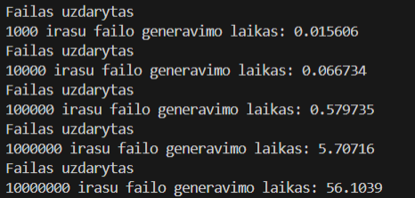
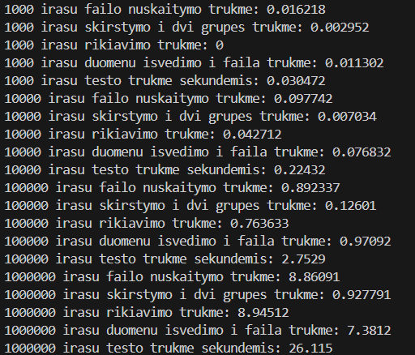
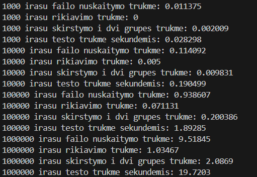

# ObjektinisProgramavimas

This is the fifth subversion of my project v1.0

## Features

1. Has a defined structure of a student, which includes the name, surname, homework grades (the amount of grades per student is not defined before the execution of the program), and grade of the exam.
2. Takes an input from the user (or from a file) to fill in the data for all the structure members for a certain amount of students (the amount of students is not necessarily defined before the execution of the program).
3. After taking input from a user it accumulates the average homework grade for every student, and also calculates the final grade for every student, and outputs it to the screen or to another file.
4. At the end of the program it outputs the name, surname and final grade of every single student to the console.
5. Has a feature where the user can choose what method to use to count the final grade - by using average of the homework grades or by using the median of homework grades in the final grade calculation.
6. If any of the inputs done by the user are incorrect, he is informed about a mistake and is prompted to input a value again (by using exception handling).
7. Has the feature where a user can enter the amount of students and grades per student at runtime.
8. Has two files, one is using dynamic memory to store student structures and their grades and the other uses vector for the same purpose and lets users input as many grades as they want at runtime.
9. Has a feature where at the very start of the program the user can choose, how does he want to run the program, so far, if the user enter a '1', then he will have to type out everything by hand, if he enters '2' the grades will be generated randomly and he will be able to generate as many grades as he wants, if he enters '3' the grades will be generated randomly and all the names and surnames will be picked randomly from the files that have one thousand names and one thousand surnames, if the user enter a '4', the program will terminate, and if he enters '5', the data will be read from a file.
10. Has all the features added to both of the files, to mainMasyvai.cpp, which only uses C arrays to store data, and to mainVector.cpp, which only uses vectors to store data.
11. Has a feature where a user can choose how he wants to sort the students (in ascending order or in descending order depending on their final grade).
12. Has a function which generates a file with names, surnames and grades of a student.
13. Has a feature of sorting the students into two different containers depending on their final grade and outputting them into two seperate files
14. Has a feature of testing several earlier generated files throughout only one execution of the program
15. Has all the code commented out.

## Darbo su vektoriais rezultatai

| Studentu skaicius | Failo generavimo trukme | Duomenu nuskaitymo trukme | Duomenu rikiavimo trukme | Duomenu skirstymo trukme | Duomenu isvedimo i failus trukme | Viso testo trukme |
| ----------------- | ----------------------- | ------------------------- | ------------------------ | ------------------------ | -------------------------------- | ----------------- |
| 1000              | 0.015606                | 0.022077                  | 0                        | 0.0096                   | 0.014761                         | 0.046438          |
| 10000             | 0.066734                | 0.098023                  | 0.037079                 | 0.017541                 | 0.094765                         | 0.247408          |
| 100000            | 0.579735                | 0.953051                  | 0.738203                 | 0.126286                 | 0.721543                         | 2.53988           |
| 1000000           | 5.70716                 | 8.93732                   | 8.12317                  | 1.08218                  | 7.37217                          | 25.5148           |
| 10000000          | 56.1039                 | -                         | -                        | -                        | -                                | -                 |

## Darbo su list'ais rezultatai

| Studentu skaicius | Duomenu nuskaitymo trukme | Duomenu rikiavimo trukme | Duomenu skirstymo trukme | Viso testo trukme |
| ----------------- | ------------------------- | ------------------------ | ------------------------ | ----------------- |
| 1000              | 0.011375                  | 0                        | 0.002009                 | 0.028298          |
| 10000             | 0.114092                  | 0.005                    | 0.009831                 | 0.190499          |
| 100000            | 0.938607                  | 0.071131                 | 0.200386                 | 1.89285           |
| 1000000           | 9.51845                   | 1.03467                  | 2.0869                   | 19.7203           |
| 10000000          | -                         | -                        | -                        | -                 |

